# 스프링 배치

이번장에서는 스프링 배치에 관하여 다루어 보도록 하겠습니다.

스프링 배치는 사용자의 작용 없이 복잡하고 대용량의 데이터를 주기적 또는 선택적으로 처리 할 수 있도록 하는 배치 처리를 위한 프로젝트 입니다.

내부 파일 또는 외부 데이터를 기반으로 일반적인 트랜젝션 방식을 사용하여 형식화된 데이터로 가공하는 역활을 하기도 합니다.

스프링 배치는 로깅, 트랜젝션관리, 작업 재시작, 작업 건너뛰기 등 자원관리를 효율적으로 해결하기 위하여 다양한 고급기술들이 들어가 있습니다(데이터베이스 이동, 변환, 대용량의 데이터 처리 등)

## 일반적인 배치 처리를 위한 시나리오

먼저 일반적으로 사용되는 배치 처리를 위한 시나리오를 생각해 보도록 하겠습니다.

1. 데이터를 읽어들입니다.
2. 읽어들인 데이터를 가공합니다.
3. 가공된 데이터를 다시 씁니다.

이 3단계가 배치 처리의 기본 시나리오 입니다.

<< 이미지 1-1. batch logical scenario >>

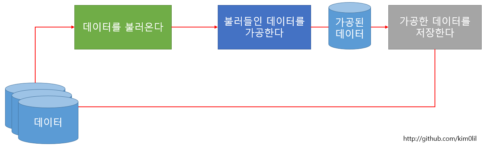

이러한 각 역활을 스프링 배치에서는 해당 인터페이스를 기반으로 처리 되고 있습니다.

<< 이미지 1-2. spring batch phsycal scenario >>

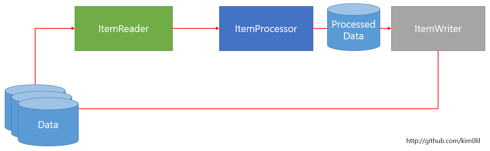

여러 건의 데이터를 한번에 처리 하기 위해서는 해당 프로세스가 여러번 실행 되어야 할 필요가 있습니다.

그래서 이 작업을 전체 작업(job)중 하나의 단계(step)로 볼수 있습니다.

따라서 아래와 같이 기본적인 배치 모델이 성립 됩니다.

<< 이미지 1-3. job & step >>

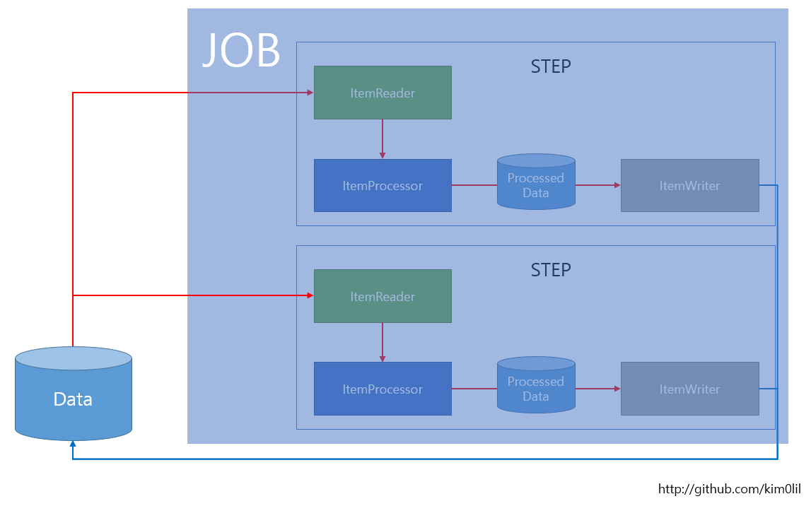

## JOB

job에 관하여 더 자세히 설명해 보도록 하겠습니다.

기본적으로 job이란 특정 행위를 하는 논리적인 단위입니다.

즉 특정한 행위에 관하여 논리적인 묶을을 말하며 "deploy job"과 같이 필요에 의하여 일정한 논리(작업명)를 가지고 있는 작업의 논리적 단위 입니다.

따라서 아래와 같이 표현할 수 있습니다.

<< 이미지 1-4. job >>

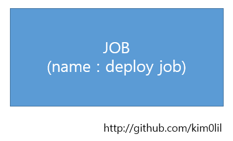

이 작업은 실제적으로 동작하기 위하여 작업 시에 일자, 구성요소 등 매개 변수를 필요로 합니다.

이 매개변수를 작업 매개변수(JOB PARAMETER)라고 하며 작업 매개변수가 추가 된 작업을 실제적으로 동작할 수 있는 작업이 되었으므로 작업 인스턴스(Job Instance)라고 합니다.

<< 이미지 1-5. job parameter & job instance >>

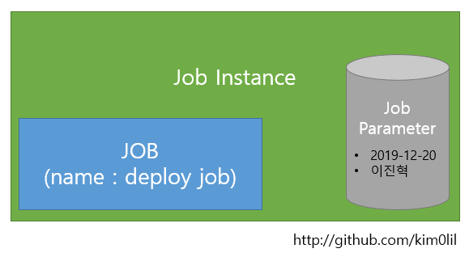

이 작업 인스턴스는 작업 중 실패 또는 재 작업을 위한 기본적인 설정을 가지고 있으며 작업 인스턴스를 재 실행 하거니 실행 정보를 확인하기 위하여 작업 인스턴스 에서는 실행 작업(job execution)을 만들어 실제 작업을 실행하고 있습니다.

<< 이미지 1-6. job execution >>

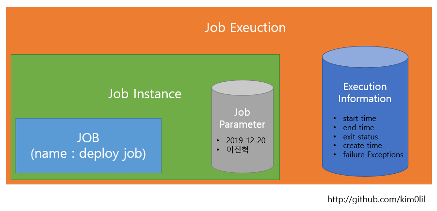

## STEP

job이 작업과 실행에 대한 전체적인 모양이었다면 step은 실제적으로 실행 되는 작업의 개념적인 처리 단위를 말합니다.

따라서 모든 job은 하나 이상의 step으로 구성 됩니다.

<< 이미지 1-7. job & step >>

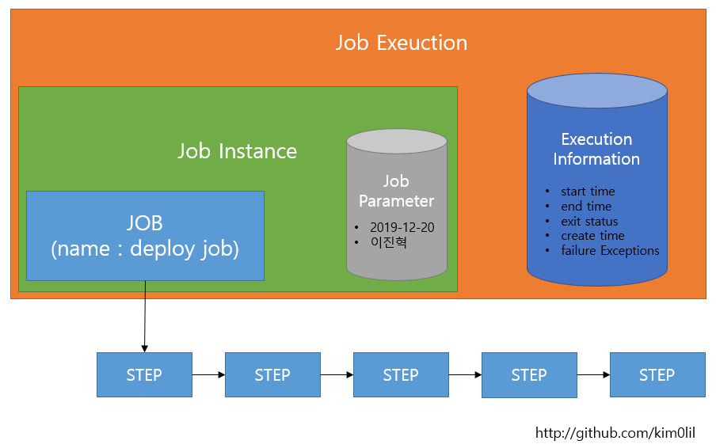

step이 개념적인 단위라면 step execution은 job execution으로 실행 되는 실제적인 실행 단위입니다.

즉 spring batch는 job execution으로 여러 step execution을 생성 및 실행하여 작업 결과를 처리 하고 있습니다.

<< 이미지 1-8. job execution & step execution >>

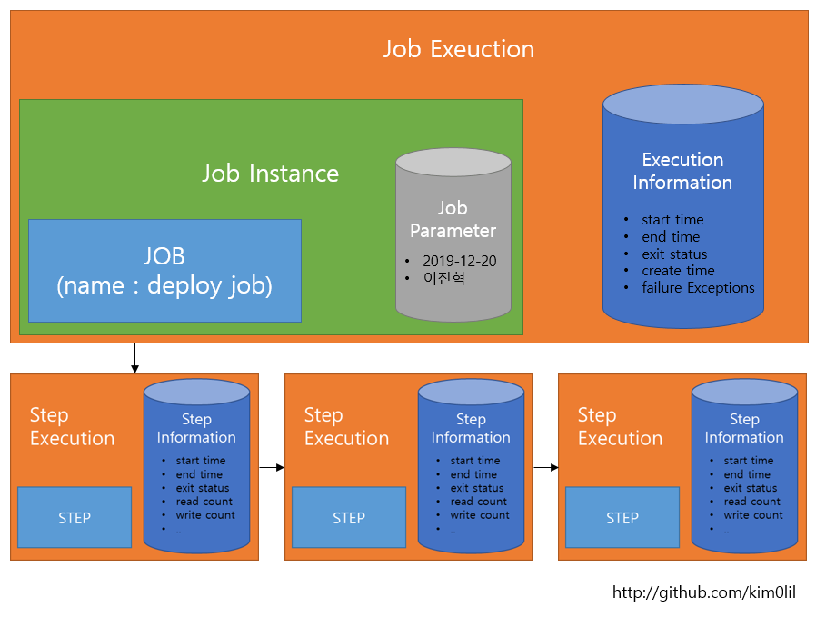

아래는 스프링 배치의 공식 사이트에서 확인한 배치 모델링입니다.

<< 이미지 1-9. spring document job & step >>

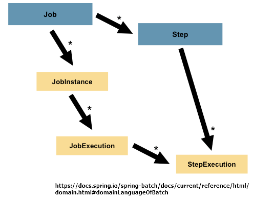

### Execution Context

Execution Context(실행 컨텍스트)는 Job Execution과 Step Execution의 상호 데이터를 교환하며 실행시에 데이터를 유지하는 방법입니다.

이 Execution Context는 Job Execution이 실행 시 넘겨 받은 ExecutionContext를 사용하여 각 Step Execution에게 전달하
며 Step Execution은 실행 도중 공유가 필요하거나 임시적으로 저장이 필요한 데이터를 Execution Context에 등록하여 치명적인 에러나 재 실행시에 등록한 데이터를 참조 하여 처리하도록 할 수 있습니다.

<< 이미지 1-10. execution context >>

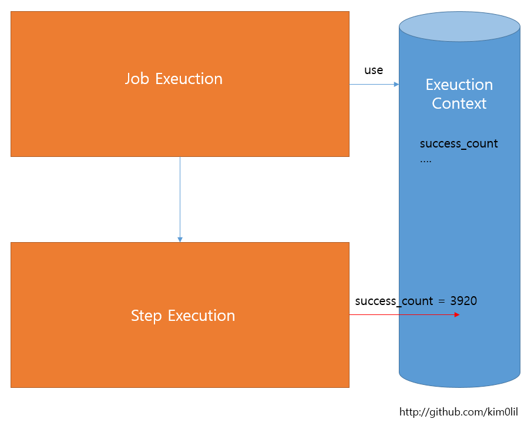

### Job Repository

Job Repository(작업 저장소)는 작업 도중 지속성이 필요한 정보를 추상화 하여 제공하는 퍼시스턴스 역활을 하고 있습니다.

즉 job execuiton이나 step execution에서 사용 되는 데이터베이스의 정보를 읽어 오거나 수정하거나 등록하는 저장소라고 볼수 있습니다.

또한 뒤에서 다룰 JobLauncher와 앞에서 다룬 Job과 각 Step을 구현하여 제공하는 역활도 하고 있습니다.

### JobLauncher

JobLauncher는 실제적으로 해당 JOB을 실행시켜 주는 역활을 하며 JOB Instance에 필요한 Job Parameter를 등록하여 Job Repository에 보내면 해당 Job으로 Job Repository에서는 Execution Context를 만들어 생성된 job Execution에 넣어 줌과 동시에 Job Launcher에서는 해당 Job Execution에 관하여 실제적인 실행 역활을 처리하고 있습니다.

<< 이미지 1-11. execution context >>

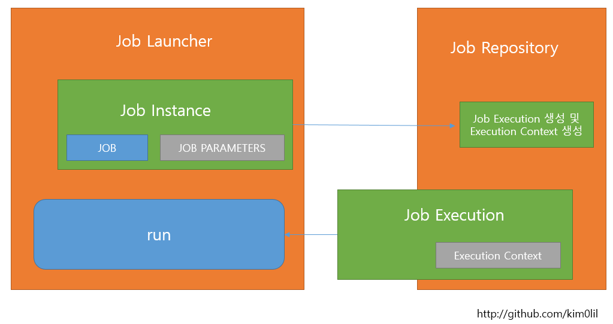

## 시작은 JobRepository

제일 먼저 살펴볼것은 JobRepository입니다.

스프링 배치에서의 JobRepository를 구현한 클래스는 SimpleJobRepository가 유일합니다. 따라서 JobRepository를 SimpleJobRepository를 사용하여 보도록 하겠습니다.

먼저 기본적인 설정을 위하여 설정파일에 @Configuration을 등록해 보도록 하겠습니다.

<< 이미지 1-12. Configuration >>

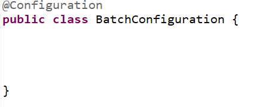

그럼 먼저 JobRepository를 등록해 보도록 하겠습니다.

JobRepository를 구현한 객체로는 SimpleJobRepository가 유일하며 해당 구현체를 생성해 주는 팩토리 객체로는 JobRepositoryFactoryBean과 인메모리 타입의 MapJobRepositoryFactoryBean이 있습니다.

먼저 MapJobRepositoryFactoryBean을 빈으로 등록해 보도록 하겠습니다.

<< 이미지 1-13. MapJobRepository >>

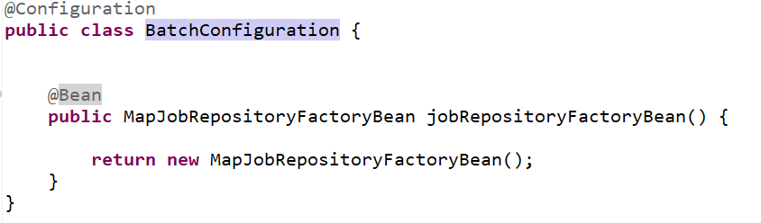

다음으로 JobLauncher를 등록 해 보도록 하겠습니다.

JobLauncher를 구현한 구현체로는 SimpleJobLauncher가 유일하므로 생성하여 등록한 JobRepositry를 추가해 주도록 하겠습니다.

<< 이미지 1-14. MapJobRepository >>

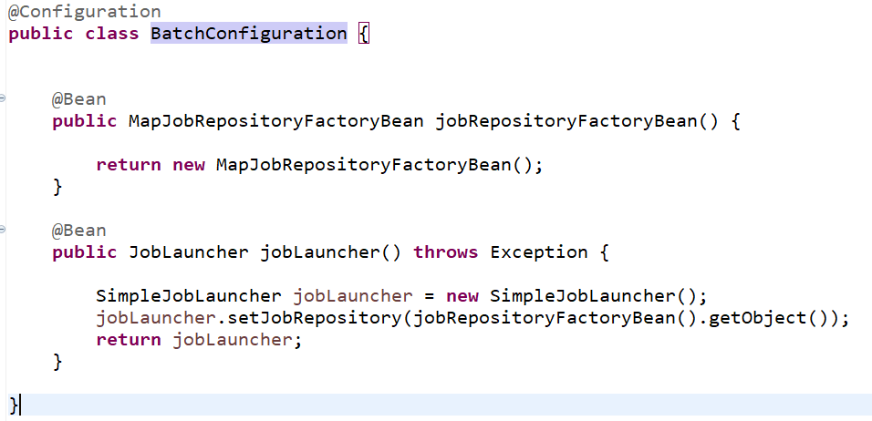

이제 간단한 Job을 만들어 보도록 하겠습니다.

Job인터페이스를 구현하여 execute 메소드에 로그를 하나 작성해 보도록 하겠습니다.

<< 이미지 1-15. SimpleJob Create >>

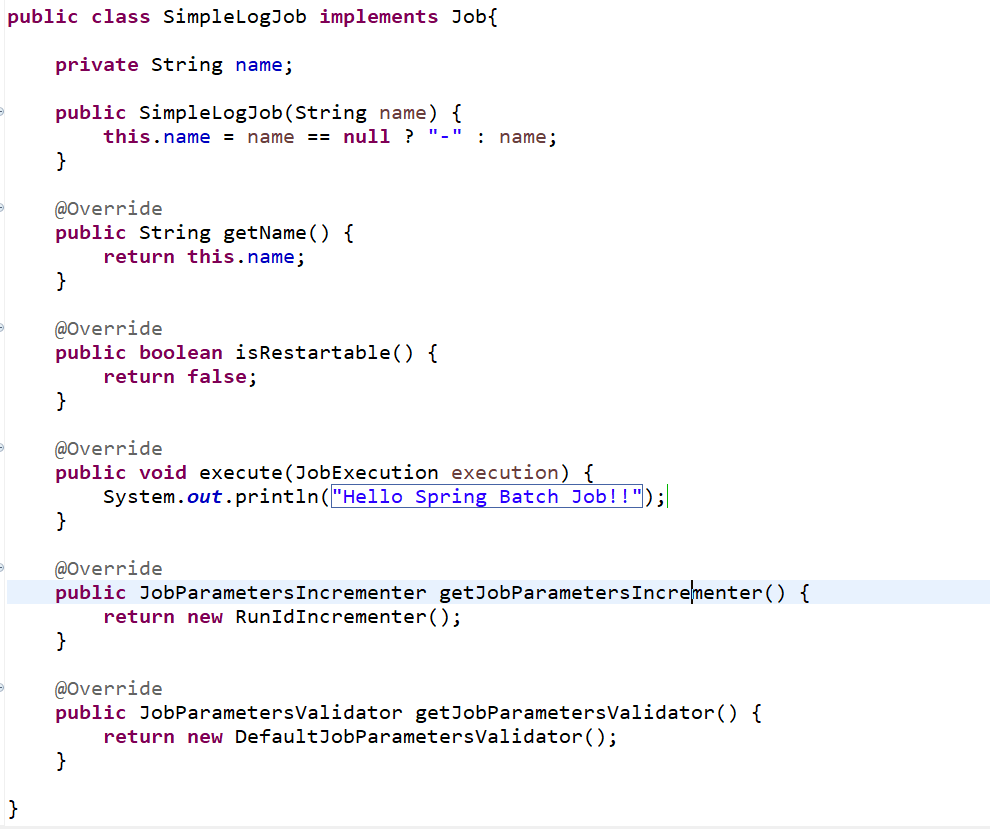

이제 등록한 Job을 실행해 보도록 하겠습니다.

실행을 위하여 메인 클래스와 ApplicationContext를 선언하여 Bean을 불러와 run메소드를 사용하여 실행합니다.

<< 이미지 1-16. SimpleJob Run >>

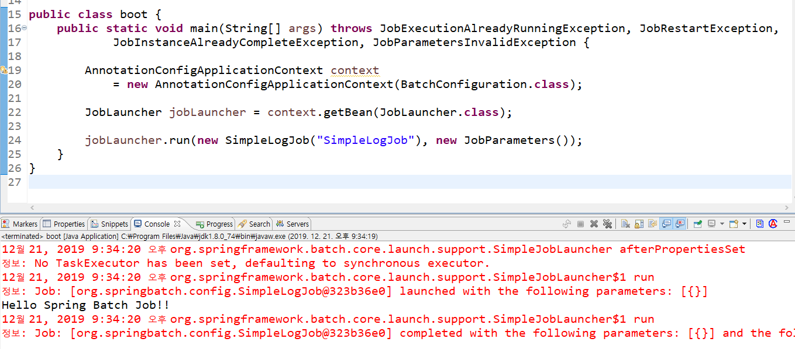

잘 실행 되는 것을 알수 있습니다.

이번에는 간단하게 Step을 생성해 보도록 하겠습니다.

Step은 Step인터페이스를 구현하여 생성할 수 있습니다.

<< 이미지 1-17. SimplStep Create >>

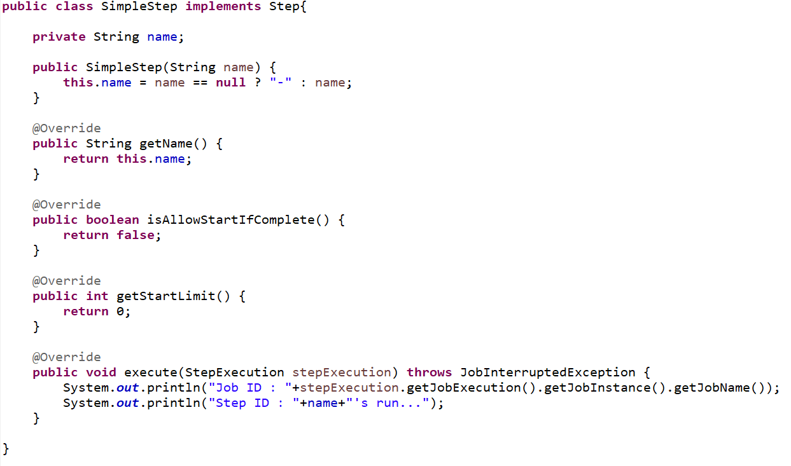

Step을 실행하기 위해서는 Job의 수정이 필요합니다.

Job을 Step에 관한 실행으로 변경 하겠습니다.

<< 이미지 1-18. SimpleJob Update >>

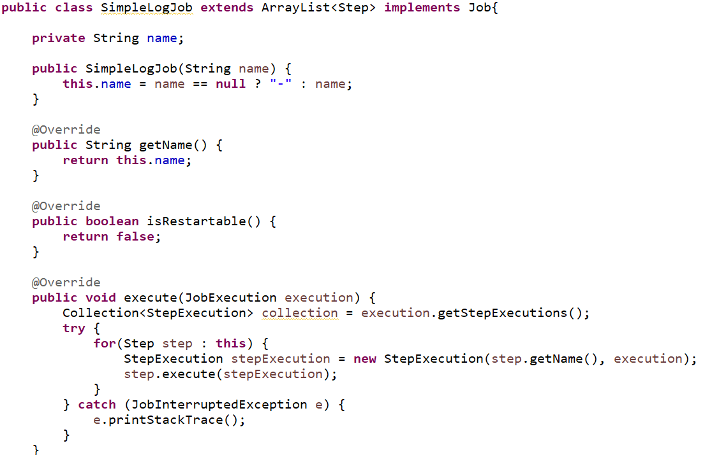

이제 실행시 Job을 Step으로 등록하여 실행해 보도록 하겠습니다.

<< 이미지 1-19. SimpleSteps Run >>

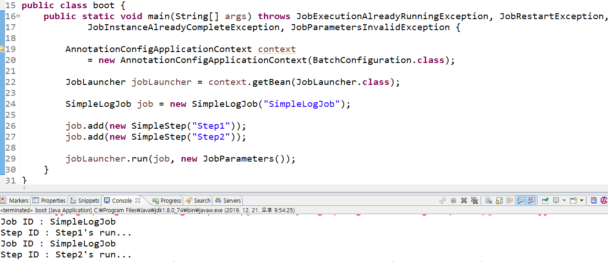

이번에는 JobParameter를 활용해 보도록 하겠습니다.

Job과 Step을 변경하여 Jobparameter를 출력해 보도록 하겠습니다.

<< 이미지 1-20. Job - JobParameter Access >>

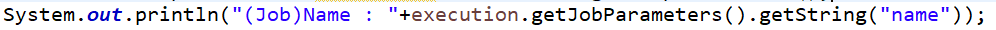

<< 이미지 1-21. Step - JobParameter Access >>

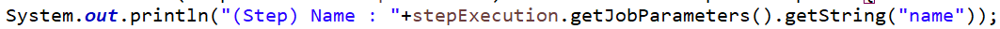

<< 이미지 1-22. Run With JobParameter >>

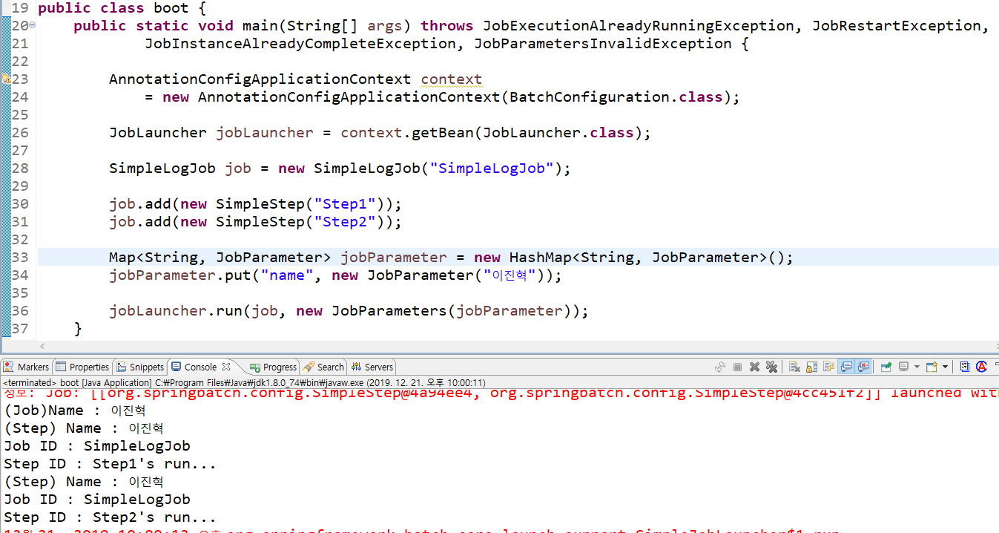

이번에는 좀 더 나아가서 파일을 읽어 들인 다음 파일 수정하여 다시 작성하는 일을 해 보도록 하겠습니다.

먼저 스탭의 처리를 FileReader(파일에서 데이터 읽어 들이기), FileUpdater(데이터 수정), FileWriter(파일로 출력)으로 분리 해 보도록 하겠습니다.

[FileReader 소스보기](./src/org/springbatch/step1/FileReader.java)

[FileUpdator 소스보기](./src/org/springbatch/step1/FileUpdator.java)

[FileWritor 소스보기](./src/org/springbatch/step1/FileWritor.java)

이번에는 step을 수정하여 각 프로세스를 처리해 보도록 하겠습니다.

[Step 소스보기](./src/org/springbatch/step1/SimpleStep.java)

부트에서 in_file과 out_file을 jobParameter로 등록한 다음 실행하면 아래와 같이 파일이 생성 되는 것을 확인할 수 있습니다.

<< 이미지 1-23. Run With File (Read - Update - Write) Step >>

### 배치와 디비연동

이번에는 데이터베이스를 연동하여 처리해 보도록 하겠습니다.

기본적으로 데이터베이스 접속 정보는 DataSource로 추상화 되어 처리 됩니다.

따라서 설정파일을 하나 만든다음 등록 한 H2를 실행하여 접속 정보를 등록합니다.

<< 이미지 1-24. Datasource Bean >>

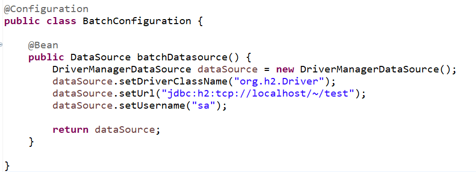

다음으로는 배치 데이터를 데이터베이스에 저장하기 위하여 데이터 베이스 초기화를 해 보도록 하겠습니다.

batch.core에 기본적인 스키마는 등록 되어 있으니 확인후 넘어 가도록 합니다.

<< 이미지 1-25. batch schema >>

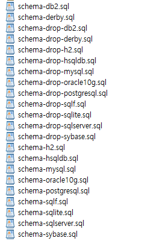

이제 초기화를 해 보도록 하겠습니다.

기존 데이터베이스 삭제 후 다시 추가 하여 배치에서 사용할 테이블을 등록합니다.

<< 이미지 1-26. batch table init >>

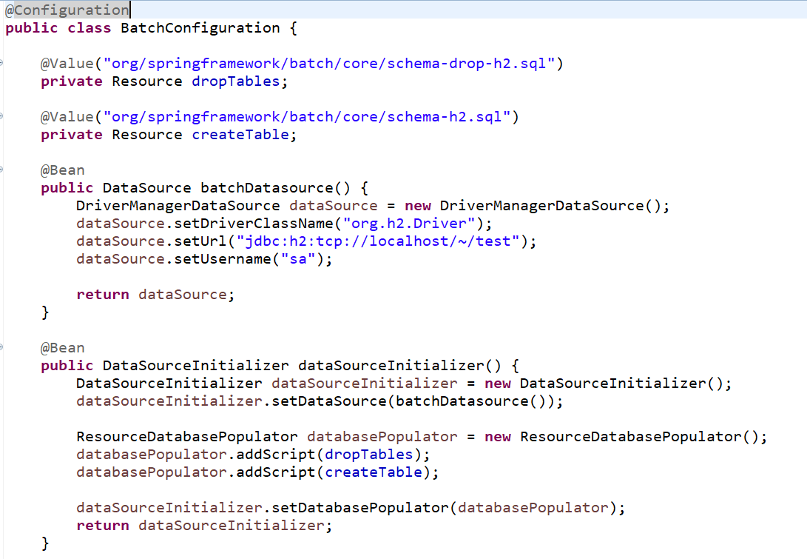

다음으로 데이터소스의 트랜젝션을 관리할 PlatformTransactionManager와 우리가 사용할 JobRepository, JobLauncher를 등록하겠습니다.

<< 이미지 1-27. batch object beans >>

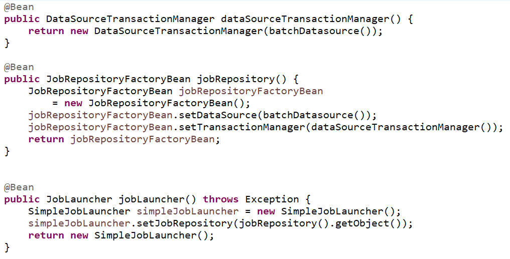

이번에는 Job을 등록해 보도록 하겠습니다.

<< 이미지 1-28. Job Instance >>

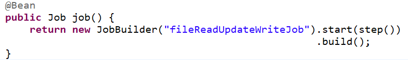

이제 step을 등록해 보도록 하겠습니다.

그 전에 step에 관한 기본적인 기능을 등록해 보겠습니다.

step은 기본적으로 아래와 같은 구조로 동작하고 있습니다.

<< 이미지 1-29. Step Structor >>

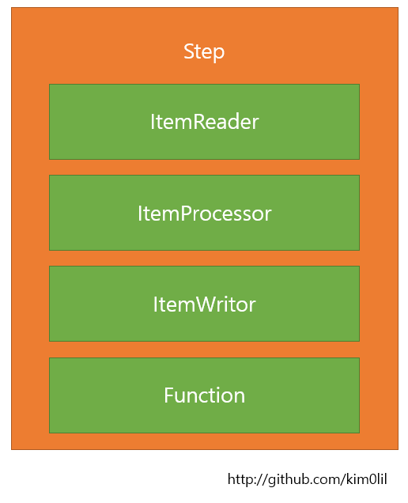

ItemReader를 사용하여 데이터를 읽어 온 다음 ItemProcessor 또는 Function을 사용하여 데이터를을 처리 하여 처리된 데이터를 ItemWriter를 사용하여 재 작성하는 것입니다.

기존에 사용하던 것과 비슷하니 일단 한번 등록해 보도록 하겠습니다.

